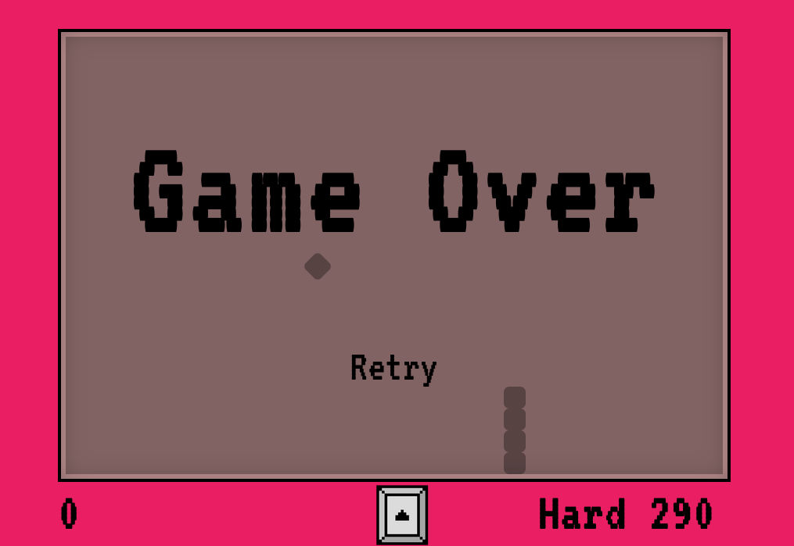

# Snake React

## Descripción

Esta es una SPA (Single Page Application) creado con React. En esta app se puede jugar al clásico juego de Snake. Cuenta con 3 dificultades, sonidos y responsive.

## Dependencias utilizadas

- React v17.0.2
- React Swipeable v6.2.0

## Instrucciones para utilizar el proyecto

- Clonar o forkear el repositorio
- Npm install
- Npm start

## Presentación y funcionalidades

### Start Screen

Pantalla principal del juego. En ella se encuentran las dificultades disponibles (Easy, Medium y Hard). Seleccionar una dificultad para comenzar el juego.

### Game

Pantalla de juego. En ella se encuentran información sobre el puntaje actual, junto con el puntaje máximo logrado en la dificultad elegida. También se encuentran las teclas de movimiento en pantalla. Para jugar al juego puede hacerlo de 3 maneras:

- Usando las teclas de dirección del teclado
- Usando las teclas de dirección en pantalla
- Usando el mouse/pantalla(mobile) para hacer swipes sobre el area de juego

### GameOver

Pantalla de gameover. Esta pantalla se mostrara cuando el juego haya finalizado, ya sea que perdió por chocarse contra con la pared, o se choco con su propio cuerpo. Podrá darle al botón de Retry para volver al menu principal y elegir jugar de nuevo.

### Responsive

La aplicación esta desarrollada con responsive. Para utilizar en pantallas táctiles, o en equipos que no cuenten con las teclas de direcciones, se agrego controles sobre la pantalla y movimientos de swipe para poder jugar.
